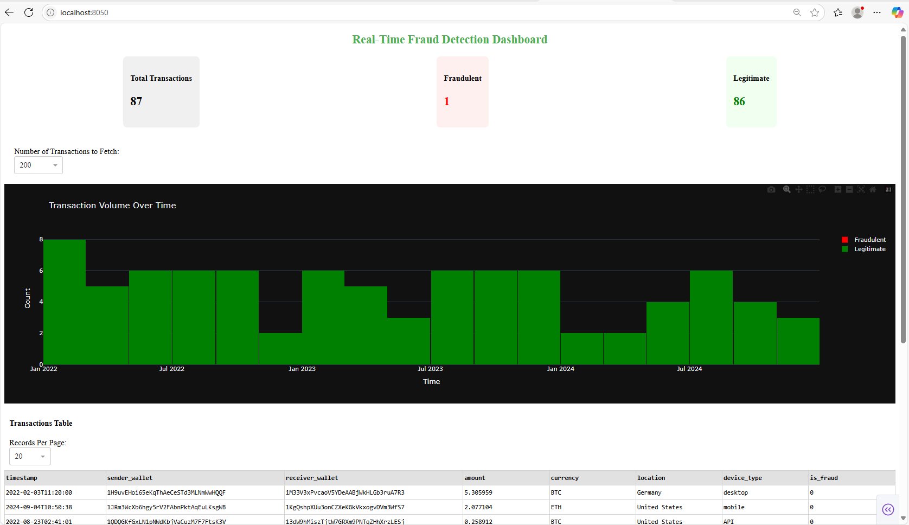
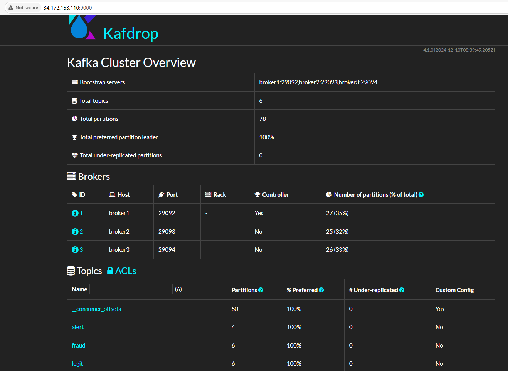
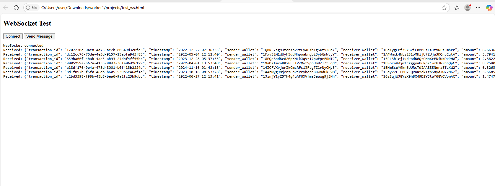
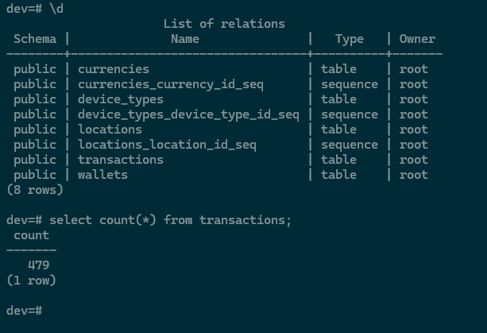
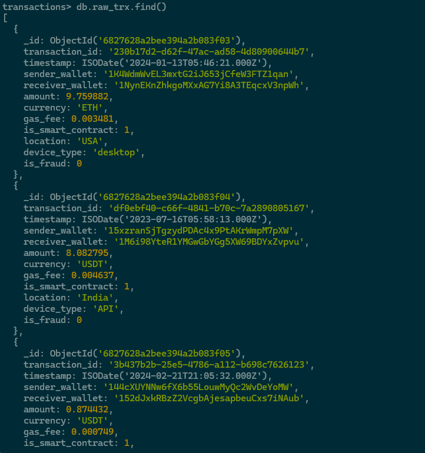
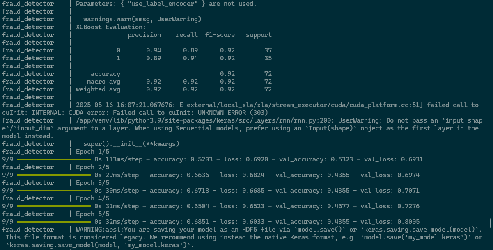

# Crypto Fraud Detection System

A full-stack real-time **Crypto Fraud Detection System** leveraging Machine Learning, Big Data, and Modern Web Technologies to simulate, detect, and visualize fraudulent cryptocurrency transactions.

---

## Table of Contents

- [Overview](#-overview)
- [Architecture](#-architecture)
- [Tech Stack](#-tech-stack)
- [System Flow](#-system-flow)
- [Model Retraining](#-model-retraining)
- [Setup and Installation](#-setup-and-installation)
- [Running the System](#-running-the-system)
- [Accessing the Dashboards](#-accessing-the-dashboards)
- [Database Access](#-database-access)
- [Usage Example](#-usage-example)
- [Project Structure](#-project-structure)

---

## Overview

This system simulates crypto transactions and detects fraudulent activity in real time using machine learning (XGBoost & LSTM). It processes data through a pipeline powered by Kafka, MongoDB, Redis, PostgreSQL, and containerized microservices.

---

## Architecture
[Simulator] --> [Kafka Topic] --> [ML Consumer (XGBoost/LSTM)] --> [MongoDB + Kafka Split (fraud / legit)]
↓
[Redis Cache] <--- [FastAPI Backend] ---> [Streamlit / Dash Frontend]
↓
[PostgreSQL Storage]

## Tech Stack

| Category            | Tools/Frameworks                       |
|---------------------|----------------------------------------|
| Backend             | Python, FastAPI, Redis                 |
| Frontend            | Streamlit, Dash                        |
| ML Models           | XGBoost, LSTM                          |
| Messaging Queue     | Kafka                                  |
| Database            | PostgreSQL, MongoDB                    |
| Containerization    | Docker, Docker Compose                 |
| Monitoring UI       | Kafdrop                                |
| WebSocket Viewer    | Custom HTML WebSocket Client           |

---

## System Flow

1. **Transaction Simulation**  
   Synthetic crypto transactions are produced and sent to a Kafka topic.

2. **Machine Learning Model Processing**  
   A Kafka consumer reads transactions and uses saved `.ps1` model files (XGBoost / LSTM) for prediction.

3. **Prediction Output Routing**  
   - All transactions saved to MongoDB.
   - Predicted **fraudulent** transactions are pushed to the `fraud` Kafka topic.
   - **Legitimate** transactions are sent to the `legit` Kafka topic.

4. **Storage and Caching**  
   - Another Kafka consumer listens to `fraud` and `legit` topics and stores them in PostgreSQL.
   - Redis is updated with the latest data for fast dashboard retrieval.

5. **Dashboard Visualization**  
   - **Streamlit Dashboard**: Real-time fraud analysis
   - **Dash Application**: Real-time Redis-connected dashboard
   - **WebSocket HTML Client**: Visualizes FastAPI-pushed transaction stream

---

## Model Retraining

The system includes a flexible, automated **model retraining** capability:

- Labeled transaction data is periodically pulled from **MongoDB**.
- Retraining uses this fresh data to fine-tune the **XGBoost** and **LSTM** models.
- Newly trained models are saved as versioned `.ps1` files.
- **The latest model version is automatically used** for live predictions.
- Retraining frequency and data granularity are configurable in the codebase.

---

## Setup and Installation

### Prerequisites

- Docker & Docker Compose installed
- Python 3.8+ (for running or modifying services locally if needed)

### Clone the Repository

```bash
git clone https://github.com/avison9/fraud_detection_system/
cd fraud_detection_system

### Start Services 

'''bash
docker-compose up --build

### Stop Sevices

'''bash
docker-compose down

### Access Services

#### Streamlit DashBoard
- Streamlit Dashboard can be visualise from '''bash http://localhost:8501

#### Dash Dashboard
- Dash Dashboard can be visualised from '''bash http://localhost:8050


#### Kafdrop UI
- Kafka Drop UI can be visualised from '''bash http://localhost:9000


#### WebSocker Viewer
- The Websocket Viewer inplace of PostMan can be visualised by running the html file in a modern brower e.g Edge/Chrome/Safari


#### PostgreSQL Access
- The postgres database can be access by running '''bash docker exec -it postgres psql -U root -d dev
- SQL queries can be run from the following prompt


#### MongoDB Access
- The MongoDB database can be access by running '''bash docker exec -it mongodb mongosh -u root -p password
- Mongo commands can be run from the following prompt



#### Model Training



